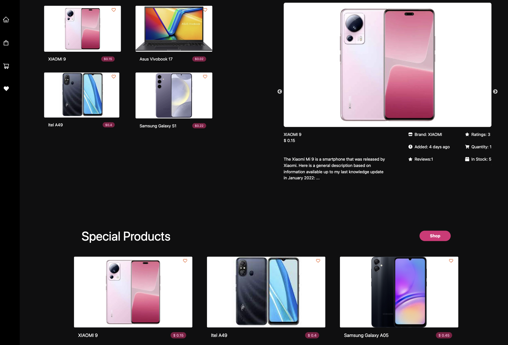
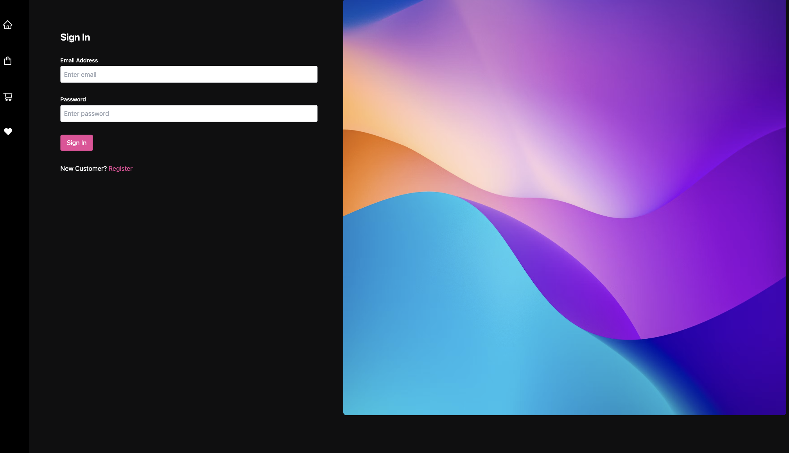
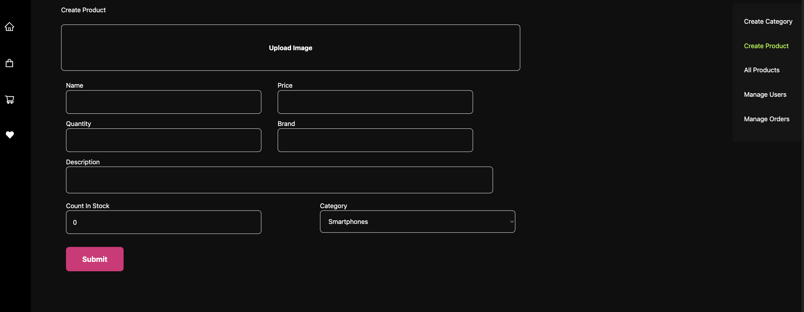
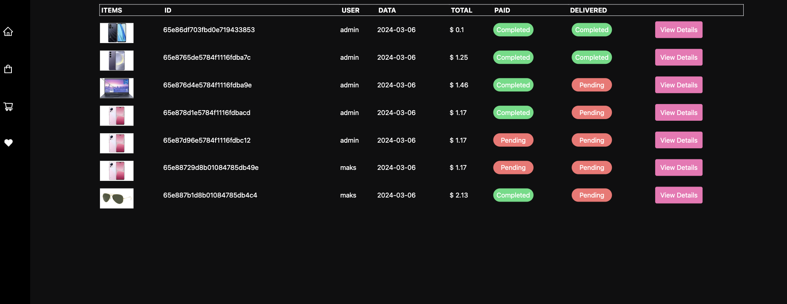
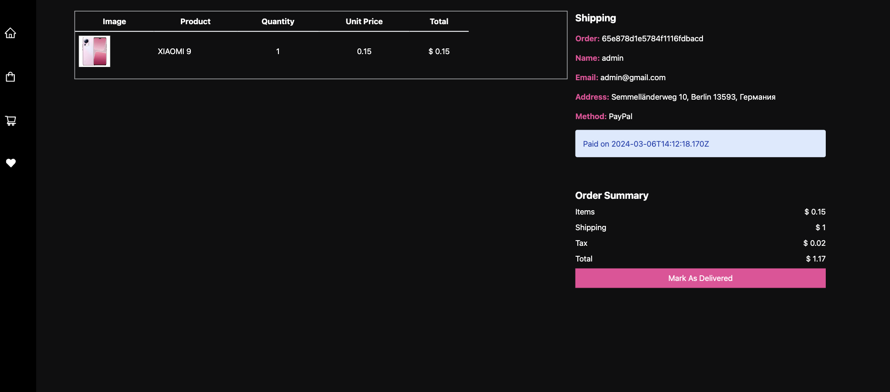
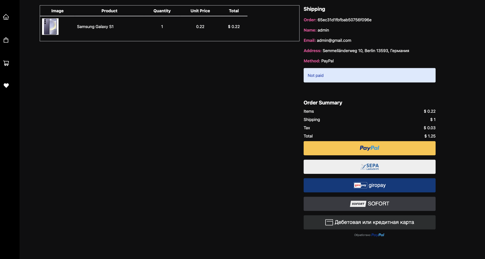

# MERN E-Commerce App

**Description:**

Welcome to E-Commerce App, a dynamic and user-friendly MERN (MongoDB, Express, React, Node.js) e-commerce platform designed to provide a seamless shopping experience. This comprehensive application integrates essential features for both users and administrators, ensuring a robust and efficient e-commerce ecosystem.

**Key Features:**

- **User Authentication:** Secure login and signup functionality for user accounts.
- **Shopping Cart:** Easily manage and track selected items before making a purchase.
- **Favorites:** Create a personalized list of favorite products for quick access.
- **Payment Integration:** Streamlined payment process with secure PayPal integration.
- **Admin Panel:** Empowering administrators with tools to manage products, categories, and orders.

Explore the screenshots to get a glimpse of the user interface and the diverse functionalities offered by [Your App Name]. Whether you're a user looking for a convenient and secure shopping experience or an administrator seeking efficient management tools, our MERN e-commerce app has you covered.

<h2>Screenshots</h2>

<h2>Version</h2>

release v1.0

<h2>Bug tracker</h2>

If you find a bug, please report it <a href="https://github.com/Maximkooo/React-gitHub/issues">here on Github!</a>

<h2>Developer</h2>

Developed by :
<a href="https://www.linkedin.com/in/maksym-synytskyi-27a0a7222/">Maksym Synytskyi</a>
<a href="https://www.linkedin.com/in/vlad-tkach-a1b821151/">Vlad Tkach</a>

<ul>
  <li><a href="https://www.linkedin.com/in/maksym-synytskyi-27a0a7222/">LinkedIn Profile</a></li>
  <li><a href="https://github.com/Maximkooo">Github Profile</a></li>
  <li><a href="https://maximkooo.github.io/synytskyi-portfolio/">Portfolio</a></li>
</ul>
